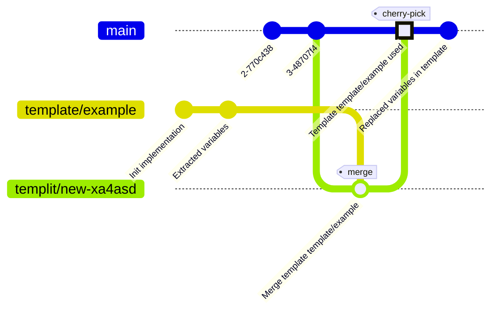

# Templit


## Overview
Templit is a CLI tool designed to streamline the process of applying templates to projects. It allows users to define templates with variables that can be replaced with specific values, making it easier to create consistent and standardized project structures.

## Features
**Template Application**: Apply templates to existing projects by merging or cherry-picking template branches.

**Variable Replacement**: Replace variables in template files with user-defined values.

**Platform Compatibility**: Handle platform-specific constraints for filenames and directory names.

**State Management**: Save and restore the state of the template application process to allow for interruptions and resumptions.

**Keeping user in control**: Templit is not trying to solve everthing for you. If in process of merging template to your branch there are conflicts, it is up to you to resolve them how you see fit.

**Transparency**: By utilizing git and branches for templates, you always know what are you getting into your repository.

## Flow

1. Templit will add (or use existing) git remote containing templates into your workdir and create new branch.
2. Template branch is merged
3. User needs to resolve any potential merge conflicts & make commit if merge did not resolve automatically.
4. Merge commit is cheryy picket to your original branch. (This step is important since, git is smart and if you try merge branch twice, it will only add new changes)
5. Discover template variables & ask user for values
6. Replecase variables in content and paths
7. Make commit.
8. User should follow any additional instructions in README.templit.md (which can/should be after deleted.)
9. User should merge / rename files named *.partial.* as those are made to avoid conflict, and allow user easy way to extend shared files.


*Note: despite showing main in the diagram, it is recommended start in work-branch not in main*

## Variables
Format for variables is `{{VARIABLE_NAME}}` or `{{VARIABLE_NAME:<case>}}`

Available cases are:
 * camelCase
 * snakeCase
 * kebabCase
 * titleCase
 * pascalCase
 * constantCase

## Creating template repository
There is two ways of creating template repository.
1. Create empty commit as first commit in repository and start template branches from there. `git commit --allow-empty -m "Empty template init"`
2. Create template branches as orphans.

After that you just add your code, add variables into code and push into branch.

Try to create conflict free code in branches.

If there are common files you want to extend. I suggest only adding part you want to add and change file name to have .partial. before extension.

So for example part of creating infrastructure would be setup bastion with pulumi in common stack.

Template could add file `bastion.ts` which contians

```ts
export const setupBastion = () => {
   // Setup bastion
};
```

And `index.partial.ts` which contains following:
```ts
import { setupBastion } from './bastion.js';

setupBastion();
```

User then either just renames to `index.ts` or combines partial file with existing `index.ts` and removes it.


That is it.

## Acknowledgements
This package uses modified version of https://github.com/lucacasonato/cases
